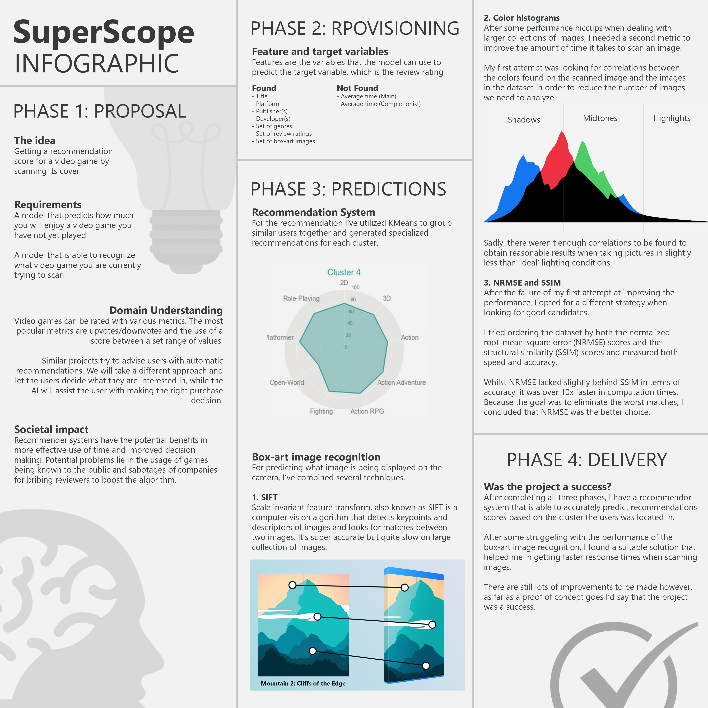

<!-- PROJECT LOGO -->

  
  
  

    Judge a video game by it's cover!
     
    <a href="https://github.com/i442124/SuperScope/tree/main/notebooks"><strong>Explore the docs »</strong></a>
     
     
    <a href="https://github.com/i442124/SuperScope/issues">Report Bug</a>
    ·
    <a href="https://github.com/i442124/SuperScope/issues">Request Feature</a>
  

<!-- ABOUT THE PROJECT -->
## About The Project
SuperScope is an image analysis tool that is able to recognize a video game that is being scanned by the camera of your mobile phone and give you a recommendation score based on what you've played in the past by using image recognition and KMeans clustering.

The review scores are provided by [Metacritic](https://www.metacritic.com/about-metacritic), a website at aiming to summarize the many entertainment reviews available for a movie or a video game into a single score. The box-art images used for recognition are composed of images provided by [MobyGames](https://www.mobygames.com/). I couldn't have realised this project without their help.